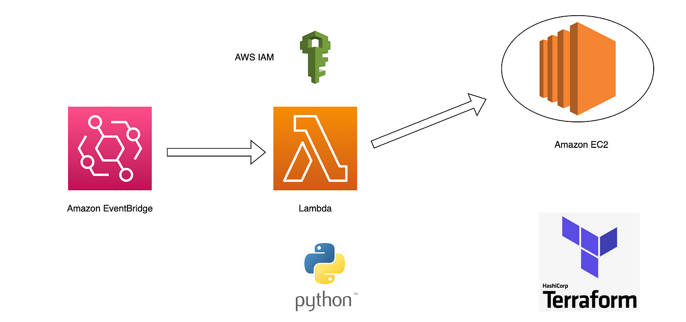

# EC2 Instance Scheduler

The EC2 Instance Scheduler project allows you to automate the starting and stopping of EC2 instances on a predefined schedule. This helps you save costs by ensuring that your instances are only running when needed, such as during business hours or specific time periods.

## Features

- **Automated Instance Management**: The project utilizes AWS Lambda functions to automatically start and stop EC2 instances based on their assigned tags.
- **Flexible Scheduling**: Instances can be scheduled to start and stop at specific times of the day, days of the week, or even on custom-defined schedules.
- **Tag-Based Configuration**: Instance schedules are determined based on the presence of specific tags. By assigning the appropriate tags to your instances, you can control their start and stop behavior.
- **Cost Optimization**: By running instances only when necessary, you can significantly reduce costs associated with idle instances, especially during non-working hours or non-peak times.
- **Easy Deployment with Terraform**: The project includes Terraform scripts that automate the provisioning of the necessary AWS resources, making it simple to set up and configure.

## Deployment and Configuration

To deploy and configure the EC2 Instance Scheduler, follow these steps:

1. Clone the repository: `git clone https://github.com/TagDhanyal/lambda-schedular-stop-start.git`
2. Navigate to the project directory: `cd ec2-instance-scheduler`
3. Update the `variables.tf` file in the `terraform` directory to customize the deployment settings. Set the desired schedule, time zone, and any other configuration options.
4. Install Terraform (if not already installed): Follow the official Terraform installation guide for your operating system.
5. Initialize the Terraform working directory: `terraform init`
6. Review the planned changes: `terraform plan`
7. Deploy the infrastructure: `terraform apply`
8. After the deployment is complete, you can verify that the Lambda functions and related resources have been provisioned in your AWS account.

## Configuration
  
To configure the EC2 instances for scheduling, follow these steps:

1. Assign the necessary tags to your EC2 instances:
   - `AutoOn`: Set this tag to `true` if you want the instance to be started according to the defined schedule.
   - `AutoOff`: Set this tag to `true` if you want the instance to be stopped according to the defined schedule.
2. Ensure that the instances have the required IAM role attached. The IAM role should have the necessary permissions to start and stop EC2 instances.

Once the EC2 instances have the appropriate tags and IAM role, the Lambda functions will automatically start and stop them based on the specified schedule.

## Cleanup

To remove the resources created by the EC2 Instance Scheduler, you can use Terraform to destroy the infrastructure:

1. Navigate to the `terraform` directory: `cd terraform`
2. Destroy the infrastructure: `terraform destroy`
